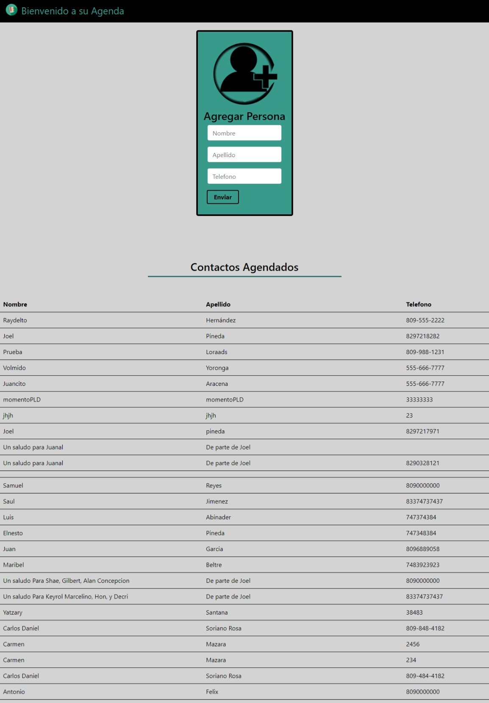

Esta tarea consiste en replicar la  agenda multicapa con javascrip, css y html pero 
esta vez en reacjs.

La agenda te debe poder agregar personas con tres campos en espesifico: nombre, apellido y telefono y asi mismo te debe mostrar un listado de las personas agregadas a esta.

Para esto utilezaremos los metodos gett y post de la funcion fetch. 
Es requerido convertir los datos a  formato json y enviarlos al siguiente enlace:
http://www.raydelto.org/agenda.php 

